# Отчёт по выполненной работе

## Навигация
1. [Part 1. Установка Linux 20.04 Server LTS](#part-1-установка-linux-2004-server-lts)
2. [Part 2. Создание нового пользователя](#part-2-создание-нового-пользователя)
3. [Part 3. Настройка сети ОС](#part-3-настройка-сети-ос)
4. [Part 4. Обновление ОС](#part-4-обновление-ос)
5. [Part 5. Использование команды sudo](#part-5-использование-команды-sudo)
6. [Part 6. Установка и настройка службы времени](#part-6-установка-и-настройка-службы-времени)
7. [Part 7. Установка и использование текстовых редакторов](#part-7-установка-и-использование-текстовых-редакторов)
8. [Part 8. Установка и базовая настройка сервиса SSHD](#part-8-установка-и-базовая-настройка-сервиса-sshd)
9. [Part 9. Установка и использование утилит top и htop](#part-9-установка-и-использование-утилит-top-и-htop)
10. [Part 10. Использование утилиты fdisk](#part-10-использование-утилиты-fdisk)
11. [Part 11. Использование утилиты df](#part-11-использование-утилиты-df)
12. [Part 12. Использование утилиты du](#part-12-использование-утилиты-du)
13. [Part 13. Установка и использование утилиты ncdu](#part-13-установка-и-использование-утилиты-ncdu)
14. [Part 14. Работа с системными журналами](#part-14-работа-с-системными-журналами)
15. [Part 15. Использование планировщика заданий CRON](#part-15-использование-планировщика-заданий-cron)

---

## Part 1. Установка Linux 20.04 Server LTS

- **Скриншот установленной версии Linux Ubuntu:**

  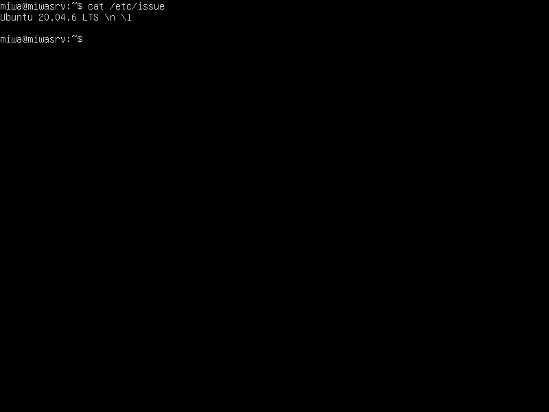  
  *На скриншоте показан результат выполнения команды `cat /etc/issue`, подтверждающий установку Ubuntu 20.04 LTS.*

---

## Part 2. Создание нового пользователя

- **Скриншот создания нового пользователя и добавления в группу:**

  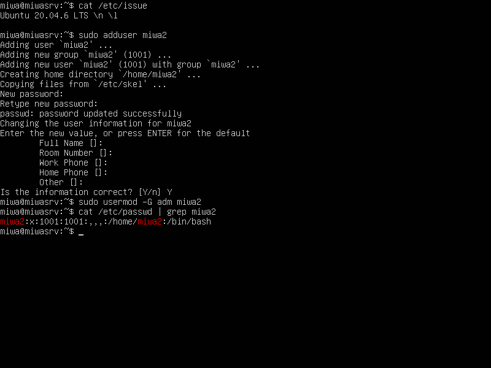  
  *На скриншоте показано выполнение команд для создания пользователя и добавления его в группу `adm`.*

---

## Part 3. Настройка сети ОС

- **Выполнение задания:**
  - Имя хоста изменено командой sudo hostnamectl set-hostname user-1.
  - Временная зона установлена через sudo timedatectl set-timezone Asia/Yekaterinburg.
  - Проверка выполнена командами hostnamectl и timedatectl.

  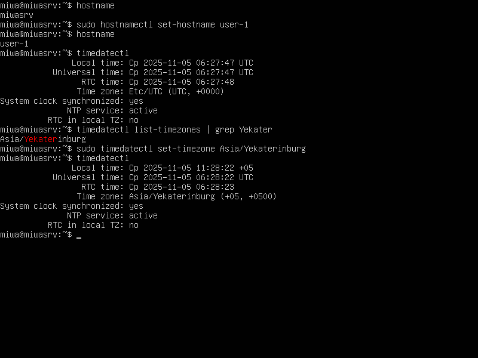  
  *На скриншоте показаны команды изменения имени хоста и установки временной зоны.*

---

- **Сетевые интерфейсы и IP адреса:**
  - Для просмотра интерфейсов использована команда ip a.
  - Интерфейс lo (loopback) - это виртуальный интерфейс, через который система обращается к самой себе localhost || 127.0.0.1 .
  - IP адрес получен от DHCP (Dynamic Host Configuration Protocol) - службы, которая автоматически раздаёт IP адреса устройствам в сети.
  - Внешний IP получен через curl ifconfig.me.
  - Внутренний IP определен командой hostname -i.

  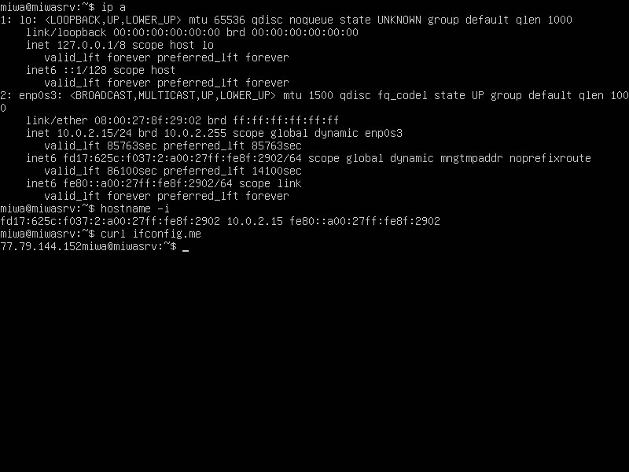  
  *На скриншоте показаны команды ip a, hostname -i и curl ifconfig.me, демонстрирующие IP устройства и шлюз.*

---

- **Настройка статических параметров:**
  - Открыт файл командой sudo nano /etc/netplan/00-installer-config.yaml.
  - Добавлены ручные параметры.
  - После перезагрузки проверено, что настройки сохранены.

  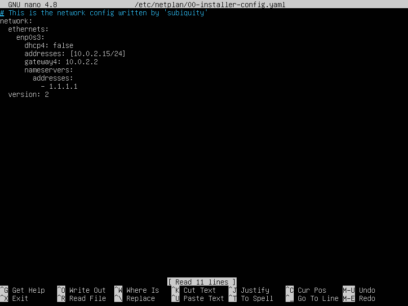  
  *На скриншоте показана конфигурация сети с ручными параметрами IP, GW и DNS.*

---

- **Проверка связи:**
- Оба пинга прошли успешно (0% packet loss).

  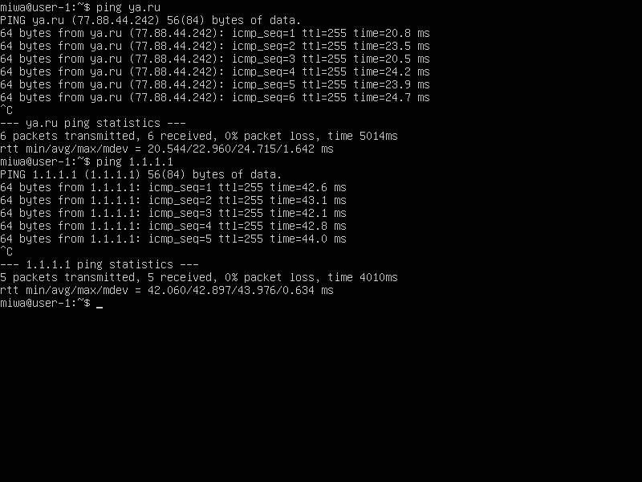  
  *На скриншоте показаны успешные пинги до 1.1.1.1 и ya.ru с результатом `0% packet loss`.*

## Part 4. Обновление ОС

- **Скриншот обновления системы:**

  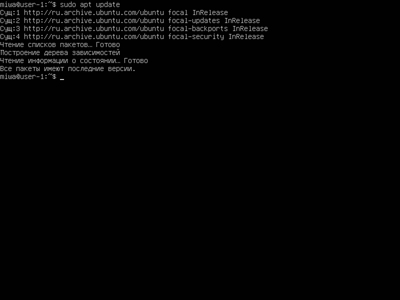  
  *На скриншоте видно выполнение команды sudo apt update.*

---

## Part 5. Использование команды sudo

- Sudo - команда которая позволяет временно выполнить действие от имени Администратора || root - права

- **Скриншот добавления второго пользователся в группу sudo и смена hostname от имени miwa2:**

  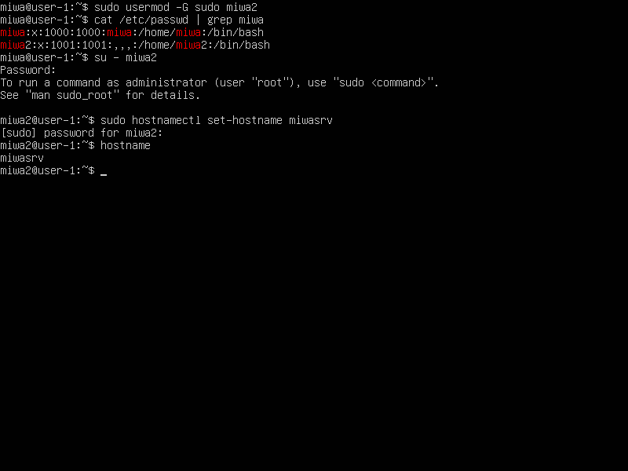  
  *На скриншоте показаны команды usermod и hostnamectl .*
  

---

## Part 6. Установка и настройка службы времени

- **Скриншот настроенной автоматической синхронизации времени:**

  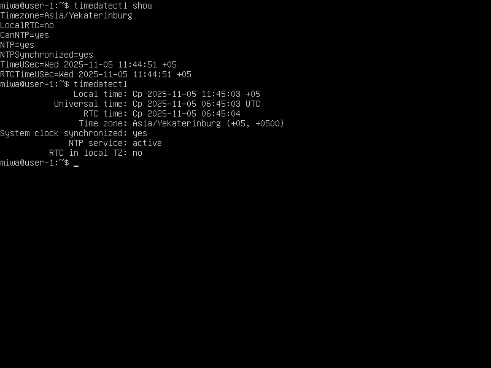  
  *На скриншоте показан нужный часовой пояс и NTPSynchronized=yes.*

---

## Part 7. Установка и использование текстовых редакторов

#### Выход с сохранением

- **Скриншот редактора nano:**

    
  *На скриншоте показано содержимое файла.*
  
  - Для выхода с сохранением данных использовалась комбинации клавиш ctrl+o -> enter -> ctrl+x

---

- **Скриншот редактора vim:**

  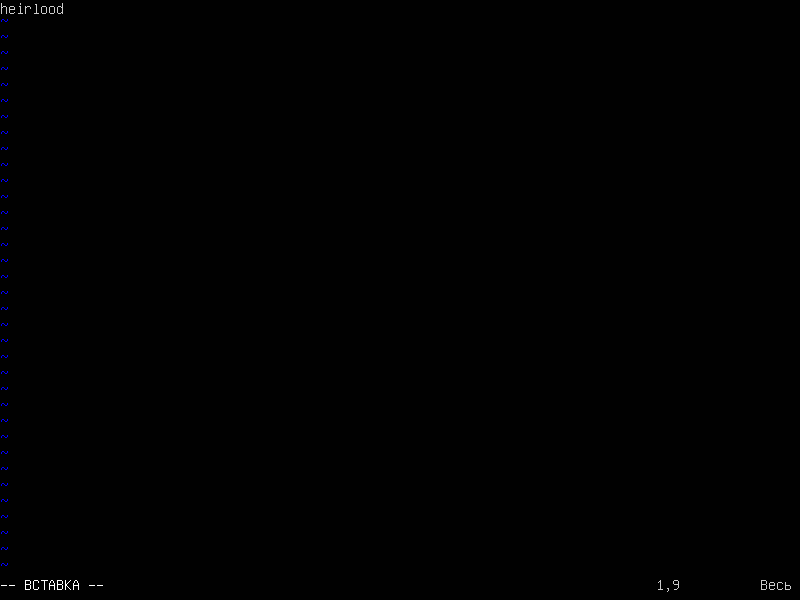  
  *На скриншоте показано содержимое файла.*
  
  - Для выхода с сохранением данных использовалась команда :wq

---

- **Скриншот редактора mcedit:**

    
  *На скриншоте показано содержимое файла.*
  
   - Для выхода с сохранением данных использовалась клавиши f10 -> Да -> enter || f2 -> enter -> f10 -> enter

---

#### Выход без сохранения

- **Скриншот редактора nano:**

  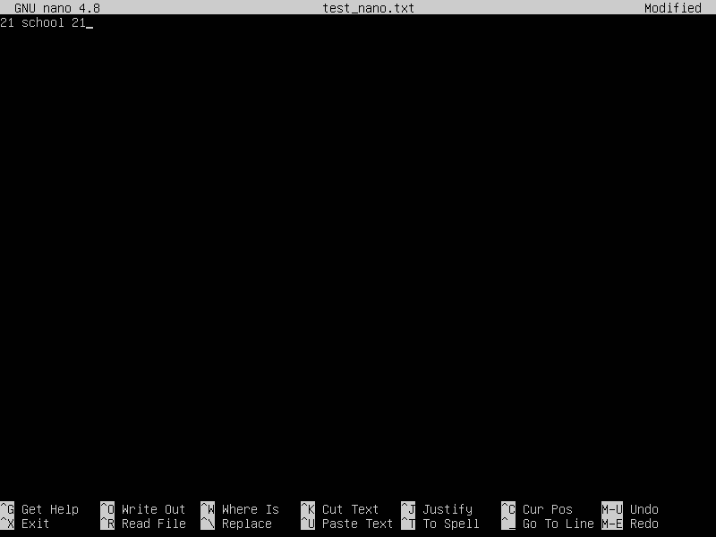  
  *На скриншоте показано содержимое файла.*
  
  - Для выхода без сохранения данных использовалась комбинации клавиш ctrl+x -> N

---

- **Скриншот редактора vim:**

  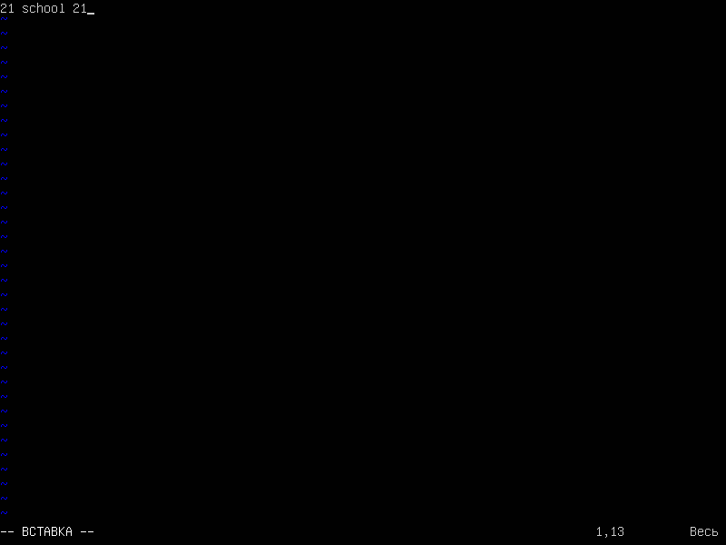  
  *На скриншоте показано содержимое файла.*
  
  - Для выхода без сохранения данных использовалась команда :q!

---

- **Скриншот редактора mcedit:**

  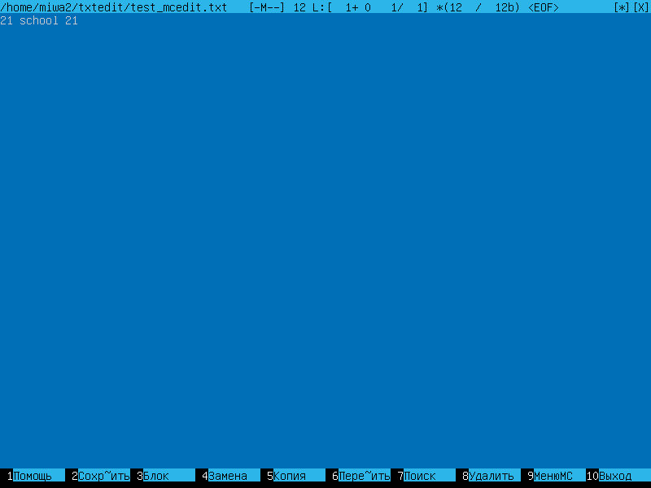  
  *На скриншоте показано содержимое файла.*
  
  - Для выхода без сохранения данных использовалась клавиши f10 -> нет -> enter

---

#### Поиск и замена содержимого файла

- **Скриншоты редактора nano:**

  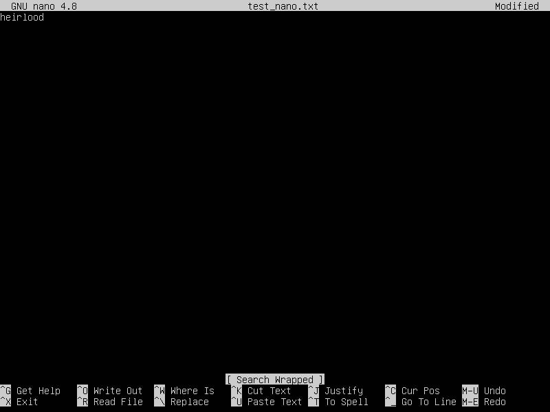  
  *На скриншоте показано, что слово найдено.*
  
   - ctrl + w - поиск
  
  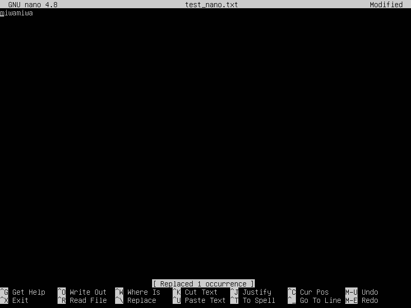  
  *На скриншоте показана замена слова.*
  
  - ctrl + \ - заменить определенное слово на другое

  

---

- **Скриншот редактора vim:**

  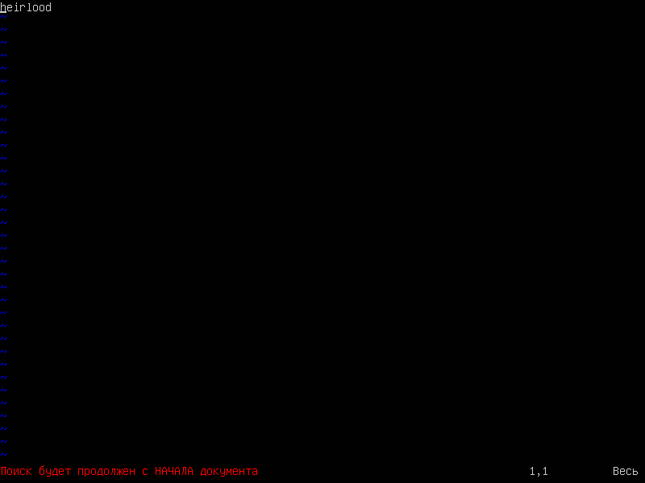  
  *На скриншоте показано, что слово было найдено*
  
  - Была использована команнда :/oldword

    
  *На скриншоте показана замена слова*
  
  - Была использована команнда :%s/oldword/newword/g

---

- **Скриншот редактора mcedit:**

  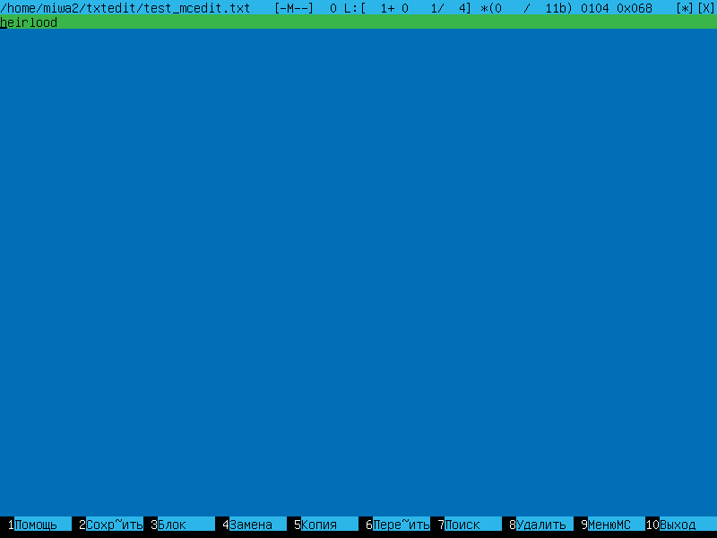  
  *На скриншоте показано содержимое файла.*
  
  - Для поиска использовалась клавиша F7

  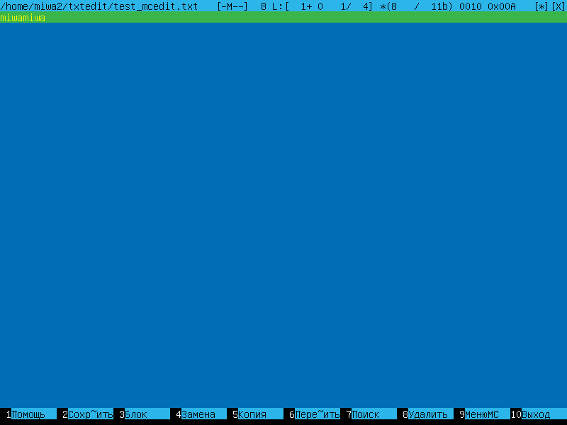  
  *На скриншоте показана замена слова*
  
  - Для поиска и замены использовалась клавиша F4

---

## Part 8. Установка и базовая настройка сервиса SSHD
    
  - Для установки использовалась команда - openssh-server
  
  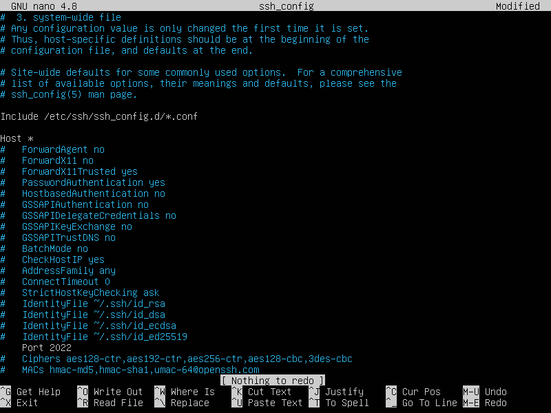  
  *На скриншоте показан готовый конфиг для смены порта*

  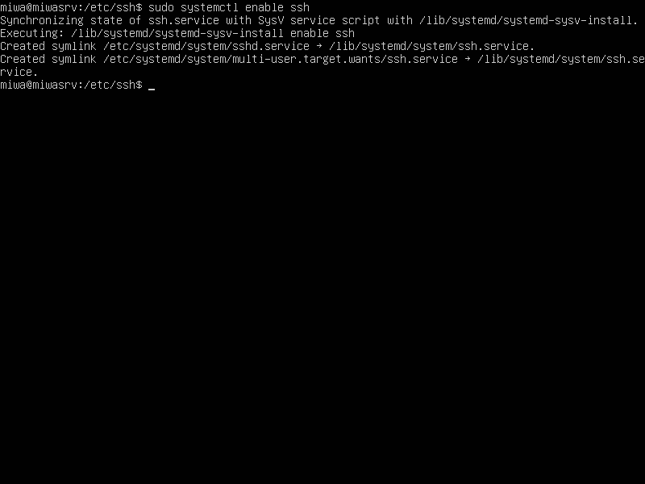  
  *Добавление слубжбы в автозагрузку systemctl enable ssh*

  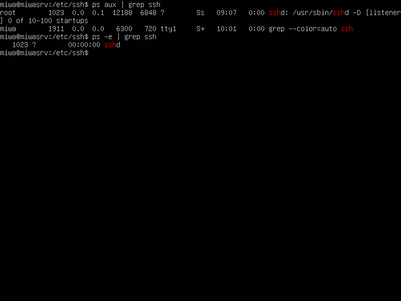  
  *Вывод команд ps aux | ps -e с использованием grep*

- *Значение ps и используемых ключей*

  - ps(process status) - показывает список процессов, работающих в системе
  - a(all) - показывает процессы всех пользователей, не только текущего
  - u(user) - показывает информацию о владельце процесса и его ресурсов
  - x - фоновые процессы
  - -e - показывает все процессы без подробной информации
  - grep - фильтр по слову

  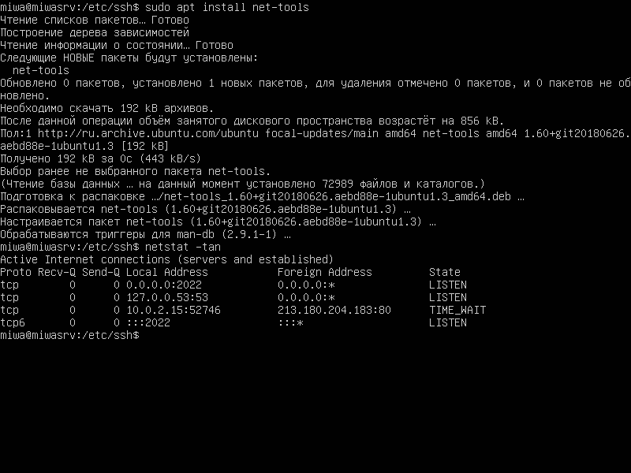  
  *Вывод команды netstat -tan*

- *Обозначение -tan*

  - -t(TCP) - показывает только TCP соединения
  - -a(all) - показывает все соединения и порты включая ожидающие(Listen)
  - -n(numeric) - показывает адреса и порты в числовом виде

- *Столбцы в netstat -tan*

  - Proto - протокол соединения
  - Recv-Q - Очередь полученных данных
  - Send-Q - Очередь отправляемых данных
  - Local Address - Локальный IP адресс и порт на котором слушает процесс
  - Forgein Address - Удаленный IP адресс и порт куда установленно соединение
  - State - Состояние соединения
  - 0.0.0.0 - Все ip адресса интерфейсов на этой машине, принимает подключение с любого сетевого интерфейса(локального и внешнего)
---

## Part 9. Установка и использование утилит top и htop

- **top**

  - uptime - 1:17
  - auth-user - 1 user
  - load average: 0,00, 0,00, 0,00
  - Tasks - 92 total
  - CPU - 0,00 us, 0,3 sy, 0,0 ni, 97,0 id, 0,0 wa, 0,0 wa, 0,0 hi, 0,0 si, 0,0 st
  - Memory - 159,6 Mib used
  - PID занимающий больше всего памяти - 1196
  - PID занимающий больше всего процессорного времени - 1865

- **htop**
  - htop был установлен командой sudo apt install htop
  
  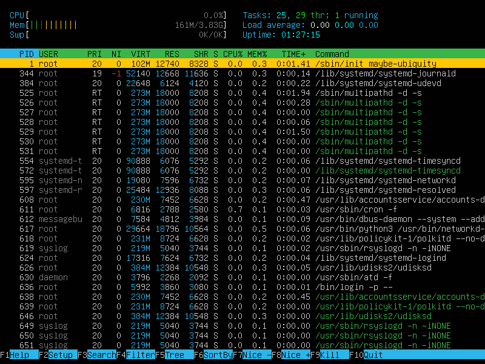  
  *Cортировка по PID*

  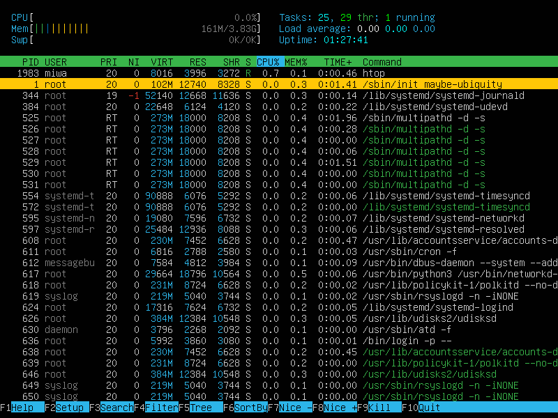  
  *Cортировка по PERCENT_CPU*

    
  *Cортировка по PERCENT_MEMORY*

  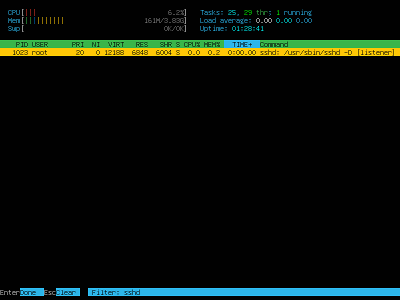  
  *Фильтр по процессу sshd*

  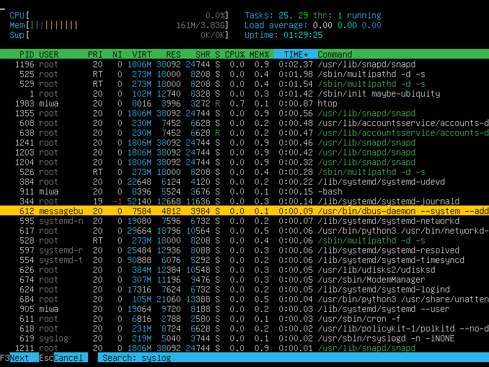  
  *Поиск по процессу syslog*

    
  *Меню добавление hostname, clock, uptime*

## Part 10. Использование утилиты fdisk

- **Использование команды fdisk -l**

  - Название диска - /dev/sda
  - Размер диска - 5,6 Gib
  - Количество секторов - 10608128 sectors
  - Swap(/dev/sda3) раздела на моей машине не было
  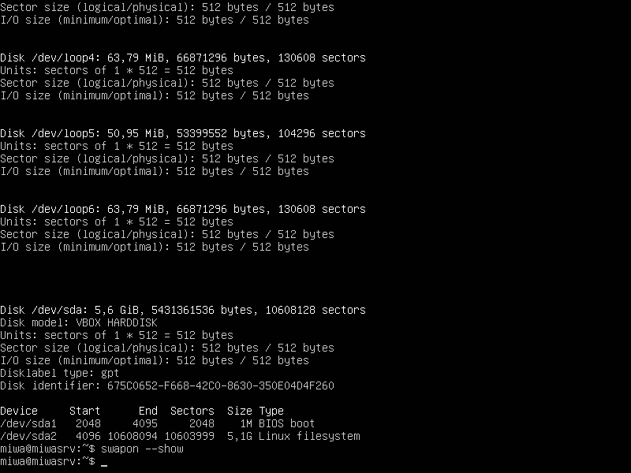  
  *swap раздела нету*

---

## Part 11. Использование утилиты df

- **Использование команды df**
  
  - Единица измерения в Килобайтах 

  *Информация о корневом разделе (/):*
  - disk space - 5139844k
  - used spcae - 3109484k
  - avaible space - 1770600k
  - percent of usage - 64%
  
- **Использование команды df -TH**

  *Информация о корневом разделе (/)*
  - disk spcae - 5.0G
  - used spcae - 3.0G
  - avaivble space - 1,7G
  - percent of usage - 64%
  - Type - ext4
---

## Part 12. Использование утилиты du
- **Вывод общей информации каталогов** 
 
  - -s(summary) - общий итог без вывода вложенных файлов и каталогов
  - -h(human-readable) - читаемый формат - KB, MB. GB

 
  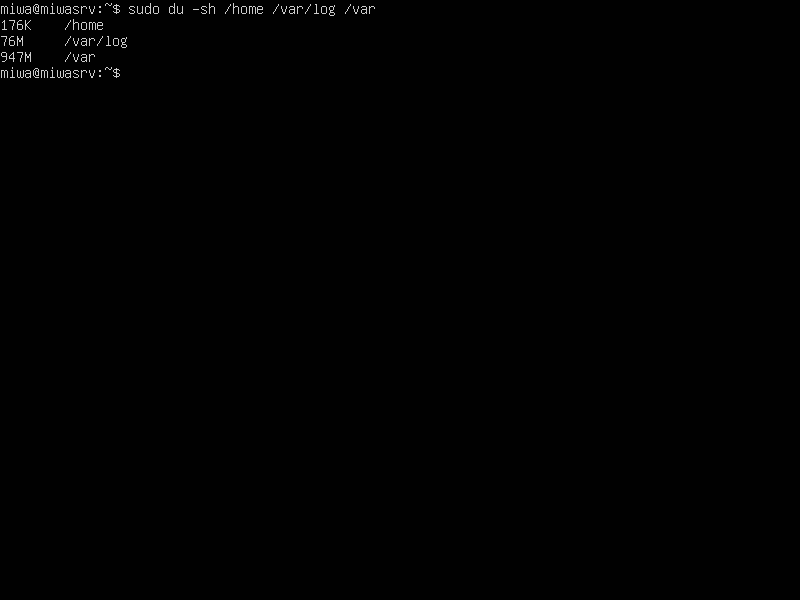  
  *Вывод команды du -sh /home /var /var/log* 
  
- **Вывод информации внутри каталогов** 
 
  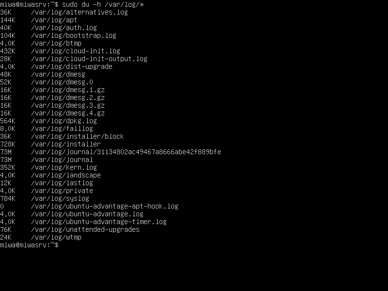  
  *Вывод команды du -h /var/log/**

## Part 13. Установка и использование утилиты ncdu

**Установка производиться командой sudo apt install ncdu**

- **Скриншоты вывода утилиты `ncdu`:**

  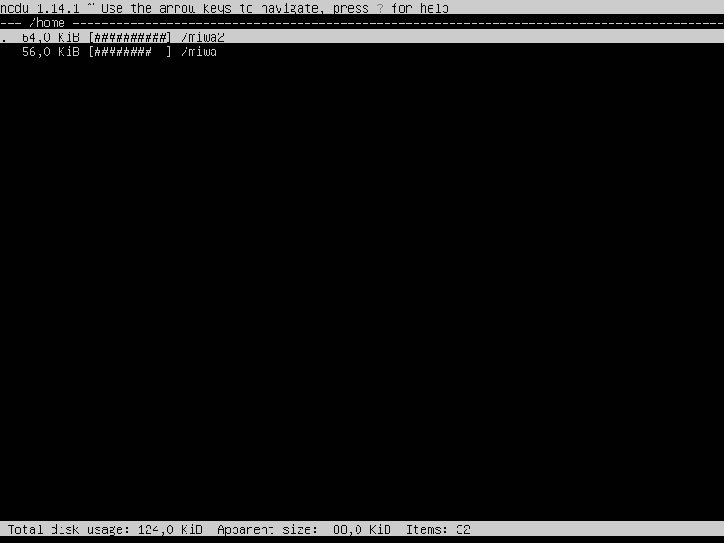  
  *Показан размер каталога `/home`.*

  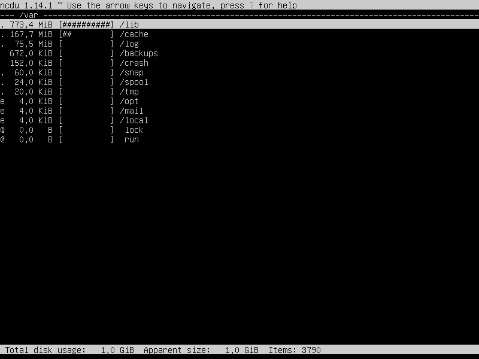  
  *Показан размер каталога `/var`.*

  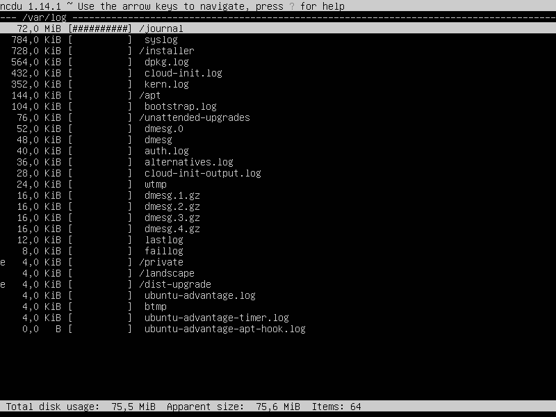  
  *Показан размер каталога `/var/log`.*

---

## Part 14. Работа с системными журналами

- **Скришоты логов auth.log и syslog**

  - Дата последней успешной авторизации - Nov 6 00:09:08 user miwa by Login
  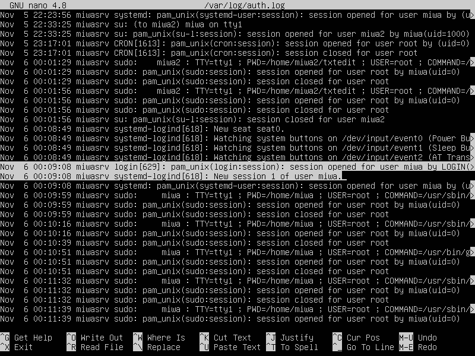  
  *Скришот найденой строчки в auth.log*  

  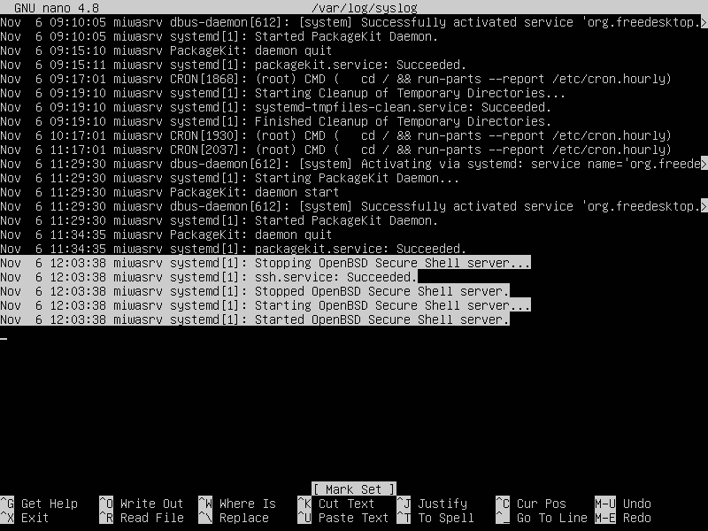  
  *Скриншот информации о перезагрузке SSHd в syslog*

---

## Part 15. Использование планировщика заданий CRON
- **Вывод списка заданий**
  
  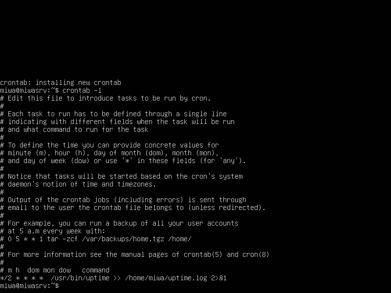  
  *На скриншоте показано текущее задание cron*

- **Результат выполнения uptime**  
  
    
  *На скришоте показаны записи в файле с разным временем запуска*

- **Логи CRON в syslog**
  
  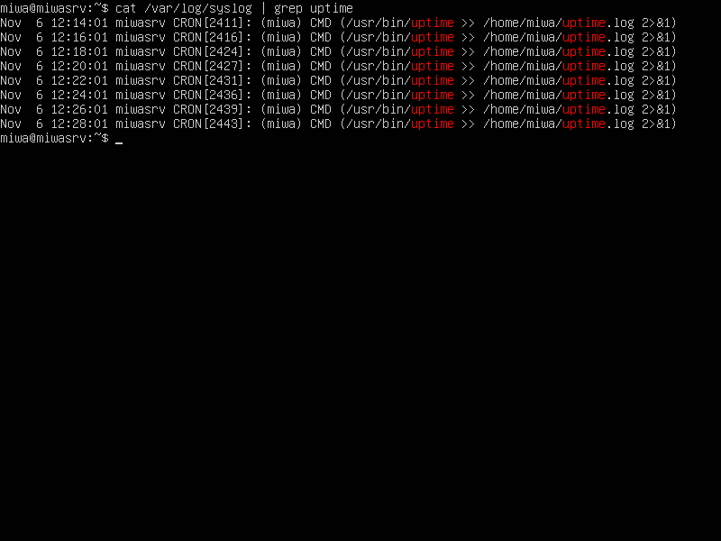  
  *На скриншоте показаны строки из syslog*

- **Удаление всех заданий из Cron**
  
  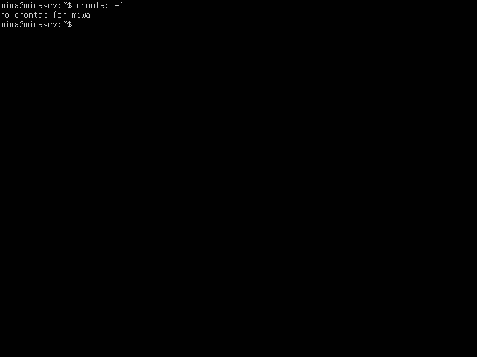  
  *После удаления список заданий пуст*